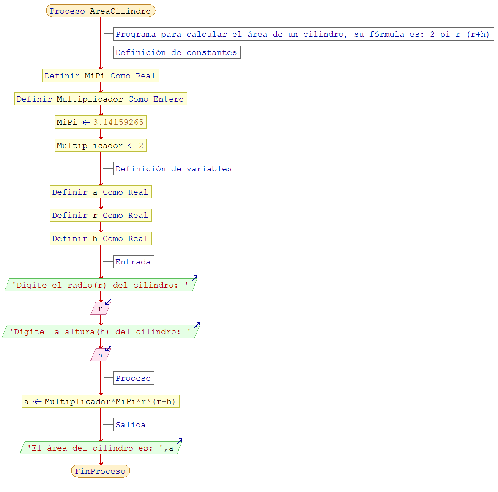

# Proyecto
Área del Cilindro

# Descripción
- El repositorio contiene archivo de *diagrama de flujo (.png)* y *código fuente (.psc)* para calcular el área de un cilindro utilizando la fórmula anterior.
- Vea los enlaces en **Recursos adicionales** para comprender como realizar el cálculo y visualizar algunos ejemplos.

# Objetivos
- Comprender los conceptos de *Entrada (E), Proceso (P) y Salida (S)*. 
- Comprender los conceptos de Variables y Constantes.
- Utilizar los *símbolos* adecuados para la creación de *diagramas de flujo*.
- Analizar como se soluciona un problema utilizando la herramienta [PSeInt](http://pseint.sourceforge.net/).

# Recursos adicionales
- Conceptos básicos sobre cilindros y como calcular el área. [Ver](http://www.ditutor.com/geometria_espacio/area_cilindro.html).
- Universo de fórmulas. [Ver](http://www.universoformulas.com/matematicas/geometria/area-cilindro/).

# Solución
## Diagrama de flujo

## Código fuente
- [Ver](AreaCilindro.psc).
