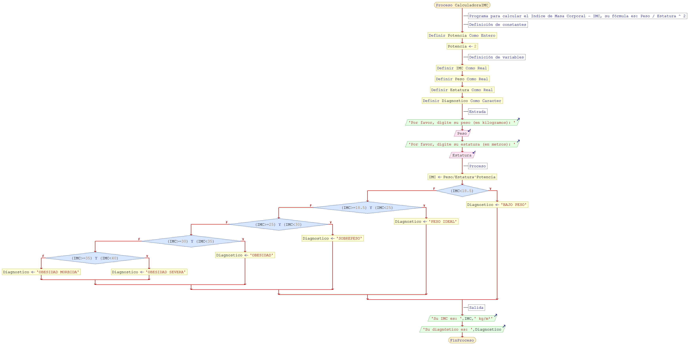

# Proyecto
ïndice de Masa Corporal - IMC

# Descripción
- El repositorio contiene archivo de *diagrama de flujo (.png)* y *código fuente (.psc)* para calcular el IMC utilizando la fórmula anterior.
- Vea los enlaces en **Recursos adicionales** para comprender como realizar el cálculo y visualizar algunos ejemplos.

# Objetivos
- Comprender los conceptos de *Entrada (E), Proceso (P) y Salida (S)*.
- Utilizar los *símbolos* adecuados para la creación de *diagramas de flujo*.
- Analizar como se soluciona un problema utilizando la herramienta [PSeInt](http://pseint.sourceforge.net/).
- Utilizar expresiones aritméticas.
- Utilizar expresiones booleanas.
- Utilizar condicionales.

# Recursos adicionales
- Conceptos básicos sobre IMC y como calcularlo. [Ver](http://www.ditutor.com/geometria/area_triangulo.html).

# Solución
## Diagrama de flujo

## Código fuente
- [Ver](IMC.psc).
